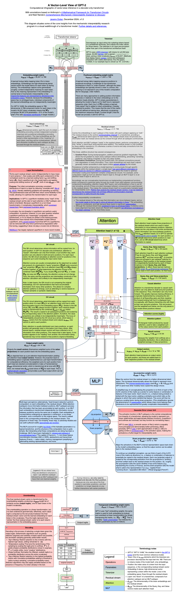

# A Vector-Level View of GPT-2
Computational infographic of vector-wise inference in a decoder-only transformer  

With annotations based on Anthropic's
*[A Mathematical Framework for Transformer Circuits](https://transformer-circuits.pub/2021/framework/)*  
and Neel Nanda's
*[Comprehensive Mechanistic Interpretability Explainer & Glossary](https://dynalist.io/d/n2ZWtnoYHrU1s4vnFSAQ519J)*

Hosted at: [https://jeremydolan.net/transformer-view/](https://jeremydolan.net/transformer-view/gpt2.svg)

